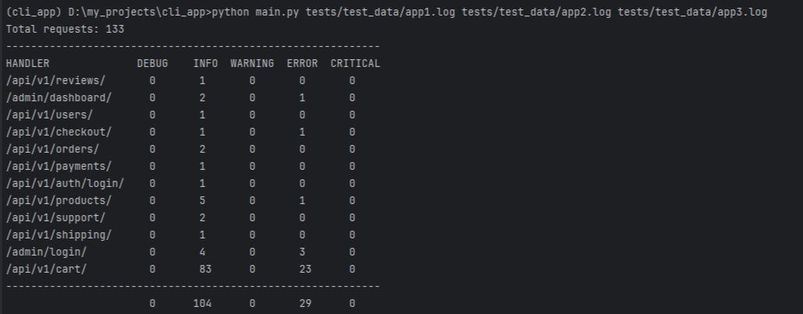

### Добавление нового отчета

Для добавления нового отчета необходимо в папке reports добавить новый файл с классом нового отчета,

который должен наследоваться от базового класса (BaseReport) 

и обязательно должен содержать методы create_report и generate.
Также новый класс необходимо добавить в REPORT_CLASSES.

Если отчет предполагает таблицу, то в папке tables нужно создать новый класс с таблицей. 

#### логи в этом проекте это не просто строки, а объекты класса RequestLog

### Пример запуска

    python main.py tests/test_data/app1.log tests/test_data/app2.log tests/test_data/app3.log

